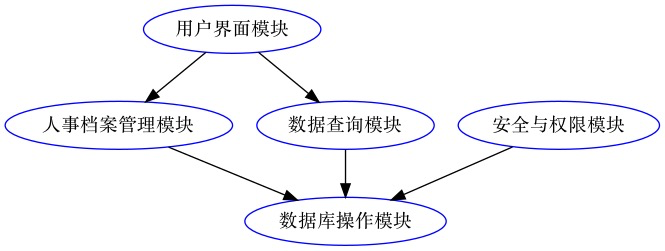
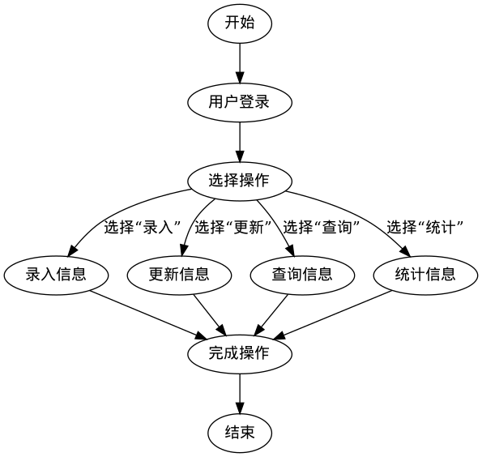
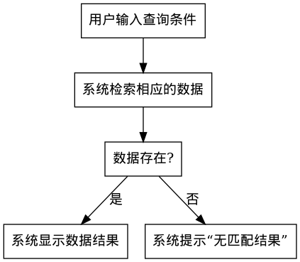
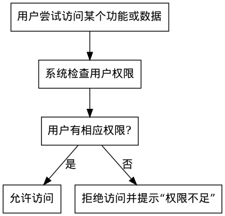
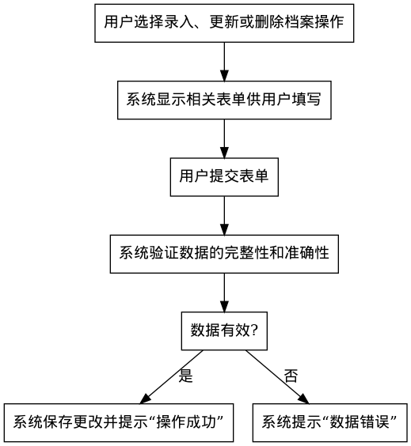
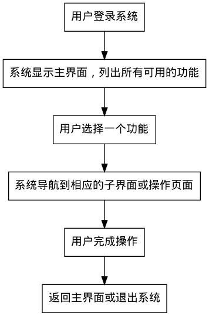

# 1. 总体设计要求

##  1.1 系统结构图



##  1.2 数据库结构

### 1.2.1 员工表 (Employees)

| 字段名称                | 数据类型 | 描述                       |
| ----------------------- | -------- | -------------------------- |
| 员工_ID (Employee_ID)   | 整数     | 主键，唯一标识每个员工     |
| 姓名 (Name)             | 字符串   | 员工的姓名                 |
| 性别 (Gender)           | 字符串   | 员工的性别，例如“男”或“女” |
| 出生日期 (DOB)          | 日期     | 员工的出生日期             |
| 入职日期 (Joining_Date) | 日期     | 员工的入职日期             |
| 职位 (Position)         | 字符串   | 员工的职位                 |
| 薪资 (Salary)           | 数值     | 员工的薪资                 |

### 1.2.2 档案表 (Records)

| 字段名称                 | 数据类型 | 描述                                                 |
| ------------------------ | -------- | ---------------------------------------------------- |
| 档案_ID (Record_ID)      | 整数     | 主键，唯一标识每个档案                               |
| 员工_ID (Employee_ID)    | 整数     | 外键，关联到员工表                                   |
| 类型 (Type)              | 字符串   | 档案的类型，例如“合同”、“培训记录”、“绩效评估报告”等 |
| 内容 (Content)           | 文本     | 档案的具体内容或描述                                 |
| 创建日期 (Creation_Date) | 日期     | 档案的创建日期                                       |

### 1.2.3 操作日志表 (Operation_Logs)

| 字段名称                  | 数据类型 | 描述                                     |
| ------------------------- | -------- | ---------------------------------------- |
| 日志_ID (Log_ID)          | 整数     | 主键，唯一标识每个日志条目               |
| 员工_ID (Employee_ID)     | 整数     | 外键，关联到员工表                       |
| 操作 (Operation)          | 字符串   | 操作的类型，例如“添加”、“修改”、“删除”等 |
| 操作日期 (Operation_Date) | 日期     | 操作的日期                               |
| 描述 (Description)        | 文本     | 描述操作的具体内容或影响                 |

# 2. 详细设计要求

## 2.1 人事档案管理模块

###  2.1.1人事档案管理模块的流程图描述 

###  2.1.2人事档案管理模块的 N-S 图描述

###  2.1.3人事档案管理模块的 PAD 描述

###  2.1.4人事档案管理模块的 PDL 描述

```PDL
BEGIN
  USER LOGIN

  SELECT OPERATION
  CASE OF OPERATION:
    "录入":
      INPUT EMPLOYEE INFORMATION
    "更新":
      UPDATE EMPLOYEE INFORMATION
    "查询":
      QUERY EMPLOYEE INFORMATION
    "统计":
      STATISTICS OF EMPLOYEE INFORMATION
  END CASE

  FINISH OPERATION
END
```

## 2.2数据查询模块

### 2.2.1数据查询模块的流程图描述


### 2.2.2数据查询块的 N-S图描述

### 2.2.3数据查询模块的 PAD 描述

### 2.2.4数据查询模块的 PDL 描述

## 2.3安全与权限模块

### 2.3.1安全与权限模块的流程图描述



### 2.3.2安全与权限模块的 N-S 图描述

### 2.3.3安全与权限模块的 PAD 描述

### 2.3.4安全与权限模块的 PDL 描述

## 2.4数据库操作模块

### 2.4.1数据库操作模块的流程图描述



### 2.4.2数据库操作模块的 N-S 图描述

### 2.4.3数据库操作模块的 PAD 描述

### 2.4.4数据库操作模块的 PDL 描述

## 2.5用户界面模块

### 2.5.1用户界面模块的流程图描述



### 2.5.2用户界面模块的 N-S 图描述

### 2.5.3用户界面模块的 PAD 描述

### 2.5.4用户界面模块的 PDL 描述