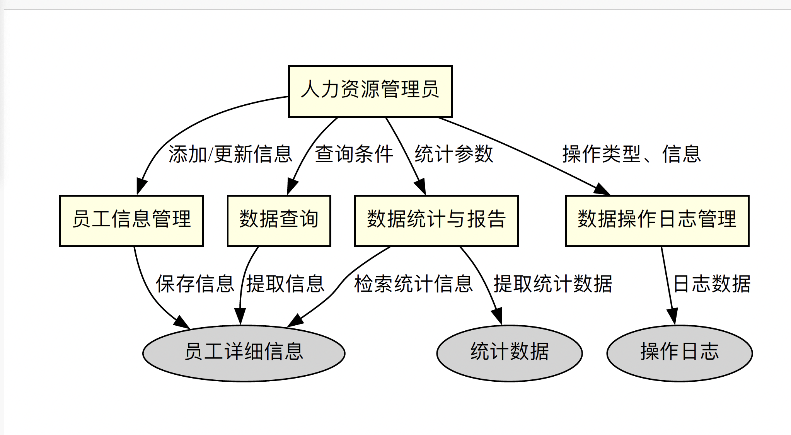

# 1.确定对系统的综合要求

## 1.1 功能要求

### 1.1.1 人事档案管理

- 能够录入、更新、查询和统计职工的基本信息，如姓名、性别、出生日期、入职日期、职位、薪资等。
- 可以分类存储职工的不同类型的档案，如合同、培训记录、绩效评估报告等。

### 1.1.2 数据操作

- 提供高效的数据统计功能，支持各种常用的统计报表生成，如按部门、职位、年龄段的职工分布情况。
- 支持多种查询条件组合，以满足不同的查询需求。
- 允许管理员进行职工数据的修改、删除操作，同时保留操作日志以追溯历史更改。

## 1.2 性能要求

### 1.2.1 速度与响应

- 确保即使在大量数据的情况下，查询和统计操作也能在几秒内完成。
- 为常用操作进行性能优化，如缓存策略、索引等。

### 1.2.2 数据存储

- 数据库设计要考虑未来的扩展性，以满足未来数据增长的需求。
- 定期对数据库进行维护，确保数据的完整性和准确性。

### 1.2.3 备份与恢复

- 自动定期备份数据，确保数据的安全性。
- 提供简易的数据恢复流程，确保在数据丢失或损坏时能迅速恢复。

## 1.3 运行要求

### 1.3.1 平台支持

- 确保系统在Windows和Linux两大主流操作系统上都能稳定运行。
- 考虑到移动办公的需求，最好也能提供移动端的支持。

### 1.3.2 网络与并发

- 优化网络访问速度，降低延迟。
- 对系统进行压力测试，确保能够支持学校的多用户并发访问。

## 1.4 其他要求

### 1.4.1 界面与交互

- 界面要简洁、直观，使得用户容易上手。
- 提供丰富的帮助文档和提示，帮助用户了解各种功能。

### 1.4.2 安全与隐私

- 对敏感信息如薪资、联系方式等进行加密存储。
- 提供用户权限管理，确保数据只能被授权的人员访问。
- 对系统进行定期的安全审计，确保没有潜在的安全隐患。

# 2.系统的数据流图 

# 3.数据字典

1. **实体**：员工属性

- 员工_ID: 每个员工的唯一标识符。
- 姓名: 员工的全名。
- 性别: 男/女/其他。
- 出生日期: 出生日期。
- 入职日期: 员工入职的日期。
- 职位: 员工的职务名称。
- 薪资: 员工的月薪。

2. **过程**：数据查询

- **输入**：搜索参数（例如，员工_ID、姓名、职位）。
- **输出**：与搜索参数匹配的员工记录。
- **功能**：根据提供的搜索参数检索员工记录。

3. **数据存储**：员工记录数据库

- **数据**：所有与员工相关的数据，包括个人详细信息、合同、培训记录、绩效评估。
- **访问**：授权人员的读/写访问权限。其他人只读访问。

4. **数据流**：更新员工记录

- **来源**：人力资源系统
- **目的地**：员工记录数据库
- **数据**：更新的员工详细信息。
- **功能**：在数据库中更新现有员工的记录。